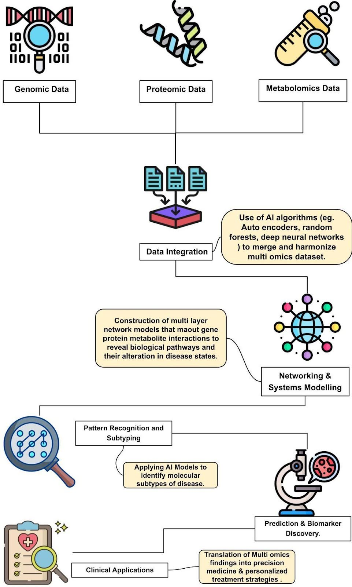
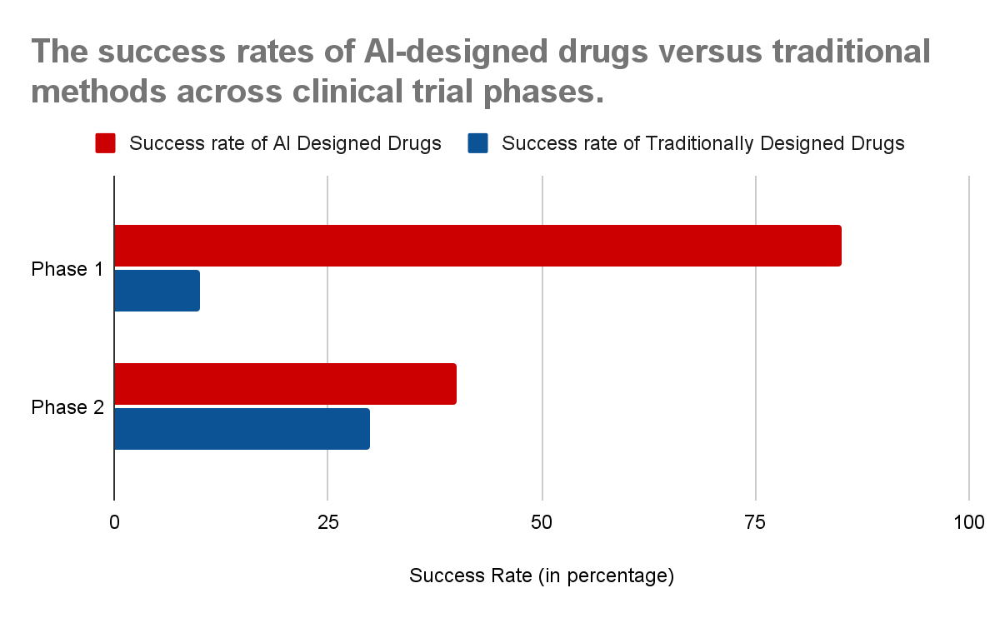
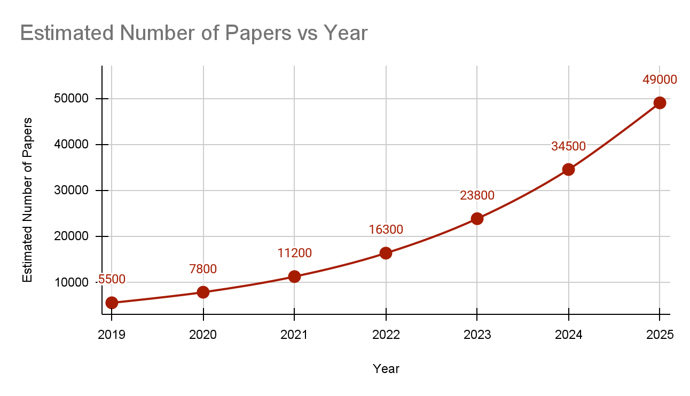
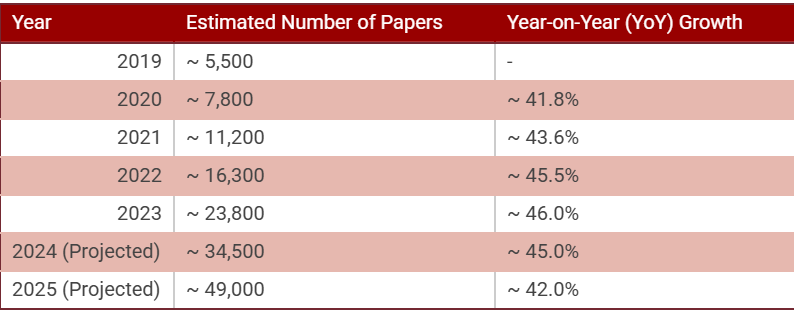
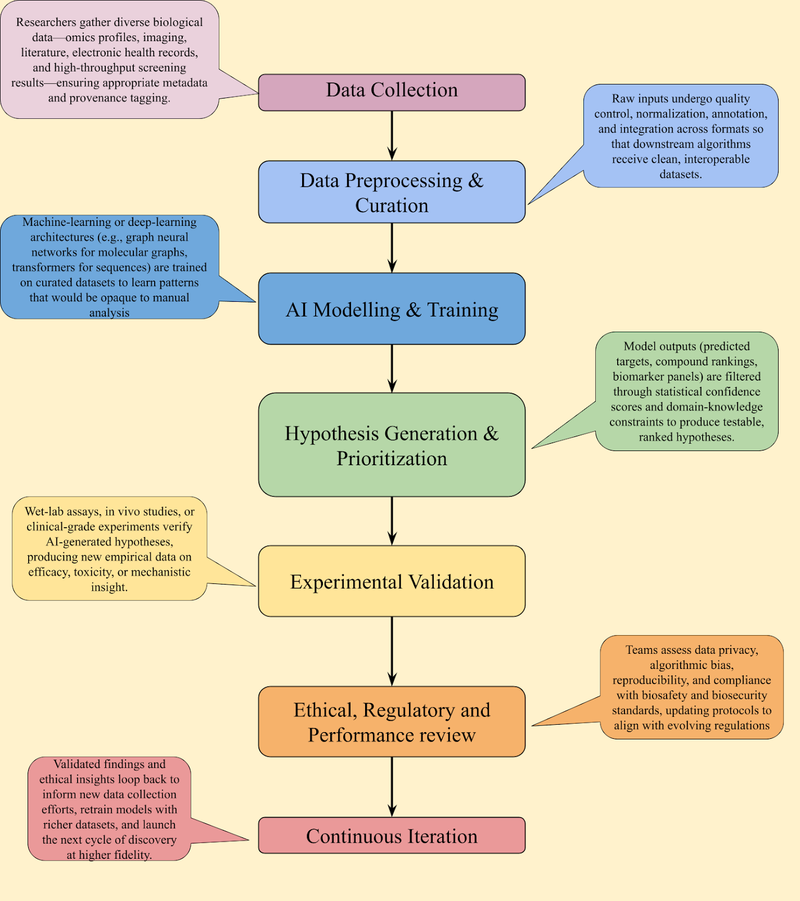

# A New Biology: Navigating Our Future with an AI Co-pilot

  

**Author:** Sarthak Prakash Srivastava  
**Affiliation:** School of Life Sciences, Babasaheb Bhimrao Ambedkar University (BBAU), Lucknow  
**Advisor:** Dr. Pooja Pandey  
**Contact:** [ssarthakprakash@gmail.com](mailto:ssarthakprakash@gmail.com)

---

## 📄 Abstract

Artificial intelligence is no longer just another instrument in the biological sciences; it has become the landscape in which a new generation of research will be conducted . This perspective argues that while AI offers a solution to the challenge of 'data overload' by deciphering complexity from the molecular to the ecosystem level, it also introduces profound risks to the integrity of our science. The rapid surge in AI-powered research publications signals both an opportunity for progress and a significant threat to scientific integrity, alongside the challenges of algorithmic bias and opaque models . To navigate this new era, we must recognize that AI is recasting our primary role from data generators to hypothesis validators and AI ethicists. This paper contends that this identity shift requires a radical update to biological education, and we propose a new framework built on curriculum reform that embeds AI tools into labs, trains students in critical validation, and forges the ethical skills necessary to ensure AI evolves as a trustworthy partner in discovery.

---

## 1. Introduction

Stepping into a biology lab or logging into a bioinformatics server today means standing at a profound inflection point. The foundational principles of biological inquiry are being reshaped in real-time by the rapid advance of artificial intelligence. While the core tenets of the scientific method remain our anchor, the tools, scale, and even the nature of the questions we can ask are undergoing a radical transformation. AI is no longer a peripheral tool for data analysis; it is becoming a central collaborator in the scientific process itself. This perspective argues that AI’s greatest impact is not in the data it processes, but in the way it is fundamentally changing the identity of the biologist. As AI automates discovery, our most vital function shifts from generating data to critically validating AI-generated hypotheses and serving as vigilant AI ethicists for the field. This evolution is happening faster than our curricula can adapt, and this perspective  contends that the immediate integration of AI tools into higher education is no longer optional, but essential for safeguarding the future integrity and equity of our discipline.

---

## 2. From Data Overload to Integrated Insight

The story of modern biology is a tale of escalating data. The Human Genome Project, once a monumental undertaking, now seems like a quaint starting point. We are immersed in a continuous stream of multi-modal 'omics' data, complemented by vast biobanks and imaging libraries. The scope of undergraduate research has shifted dramatically; projects that would have been unthinkable a decade ago, routinely involve analysing datasets of a size that defies human-centric exploration. It is in this environment that AI has become an absolute necessity.
Initially, machine learning offered a lifeline, a way to find patterns in the deluge, such as identifying disease-associated variants in genome-wide association studies¹. But the horizon has already shifted. Today’s more sophisticated models are moving beyond pattern recognition towards true knowledge integration. By weaving together genomics, proteomics, and clinical data, AI is beginning to construct systems-level models of disease and physiology that capture the non-linear complexity of life². In this era of integrated data, textbook diagrams of isolated pathways feel increasingly incomplete. We are now being equipped to see the whole system, and it is AI that is providing the lens. As AI masters the role of data synthesizer, the biologist's core task is elevated: from generating isolated data points to designing the crucial experiments that validate or refute the complex, system-level hypotheses these models produce.

  
   
  <em><strong>Fig. 1:</strong> Diagram  illustrating the integration of multi-omics data (genomics, proteomics, metabolomics) by AI to create a systems-level model of a biological process, such as a disease pathway. A flowchart showing data inputs converging into an AI model, outputting a network of interactions.</em>

---

## 3. A New Intuition for the Molecular World

Nowhere is this paradigm shift more palpable than in structural biology. The protein folding problem was, for decades, a textbook example of biology’s grand challenges. When DeepMind’s **AlphaFold2** effectively solved it³, the news rippled through our lecture halls with an almost seismic force. What was once the domain of years-long, highly specialized experimental work became accessible with a few clicks. The public database of over 200 million predicted structures is not just a resource; it is a new foundational layer for molecular biology⁴.

This changes everything. It reframes the starting point for experimentation. The ability to visualize a protein's structure almost instantly presents us with hundreds of millions of structural hypotheses, shifting the primary scientific bottleneck from structure determination to the creative work of designing functional experiments to validate these predictions in the lab. This has immediate, powerful implications for drug discovery. The AI-driven discovery of the antibiotic **Halicin⁵** was not an anomaly but a harbinger of a new methodology, where in silico screening can precede and guide wet-lab experimentation, dramatically shortening discovery timelines. Platforms like Insilico Medicine’s Pharma.AI and Recursion’s OS integrate vast datasets to identify novel drug targets and predict clinical trial outcomes, reducing development timelines from years to months in some cases¹⁴. For example, Insilico’s AI-designed drug **Rentosertib** successfully completed a Phase 2a trial for a rare disease, marking a clinical milestone for AI-driven discovery¹⁵. Similarly, companies like Atomwise use deep learning to screen trillions of compounds, targeting complex diseases like cancer and neurological disorders¹⁶. These advancements suggest a future where AI not only accelerates discovery but also tackles previously intractable targets.

However, this accelerated promise must be tempered with realism. For every milestone like rentosertib, there are cautionary tales. Despite the hype, some AI-designed drugs have stumbled in clinical trials. To cite an instance, a 2023 analysis noted that several AI-generated candidates failed Phase 3 trials due to issues like insufficient efficacy or unexpected toxicity, often stemming from biased training data or over-optimistic in silico predictions¹⁷. In Phase I trials, AI-designed molecules show an impressive 80–90% success rate, significantly higher than the industry’s historical 10% average, but this drops to around 40% in Phase II, indicating challenges in translating computational promise to human outcomes¹⁸. These setbacks highlight a critical lesson for my generation: while AI can generate promising candidates, rigorous experimental validation remains essential to bridge the gap between digital models and biological reality.
This reality solidifies the future role of the biologist not as a mere user of these tools, but as the essential, skeptical validator who bridges the gap between in silico promise and biological reality.

  
   
  <em><strong>Fig. 2:</strong> Comparing the success rates of AI-designed drugs versus traditional methods across clinical trial phases (Phase I: 80–90% vs. 10%; Phase II: ~40% vs. ~30%).</em>

Looking forward, the frontier is already moving toward de novo protein design⁶. The idea that we can use AI not just to understand nature's proteins, but to design entirely new ones with novel functions, is perhaps the most exciting prospect of all. It positions our generation not merely as observers of the biological world, but as potential architects.

---

## 4. Expanding Vision & Guarding Integrity

This new lens is not limited to the microscopic. AI is granting us an unprecedented capacity to understand and manage our planet’s ecosystems. The immense challenges of biodiversity loss and climate change require analysis at a scale that has always been difficult to achieve. Today, deep learning models can autonomously analyse millions of camera trap images to monitor elusive wildlife⁷ or process satellite data to track deforestation in near real-time⁸.
This is more than just improved monitoring; it is enabling a transition to a predictive science of ecology. By integrating diverse data streams—from environmental DNA in a river to acoustic monitoring in a forest⁹—we can build models that forecast how ecosystems will respond to change. These tools offer a glimmer of hope to a generation acutely aware of the environmental crisis it is inheriting. They provide a means to move beyond simply documenting loss to proactively identifying conservation priorities and modelling the impact of potential interventions.

# An Urgent Responsibility: Guarding the Integrity of Our Science

With this incredible power comes an urgent and profound responsibility. As we embrace AI, we must be clear-eyed about the risks it introduces. These are not abstract, future problems; they are active threats to the scientific enterprise we are about to join.
The first is **algorithmic bias**. An AI model trained on skewed data will produce skewed results. The current overrepresentation of European-ancestry genomes in databases means that the promise of personalized medicine could, perversely, widen global health inequities if we are not careful¹⁰. As new entrants to the field, we must champion the global effort to build more inclusive and representative datasets.
Championing inclusive datasets is no longer a task for specialists; it is a core ethical responsibility for every biologist. We are all now curators of the data that shapes future discoveries, making a foundational understanding of data ethics a non-negotiable skill.
A second, more subtle challenge is the **'black box'** problem. When an AI model offers a conclusion without a clear, interpretable reason, it challenges the scientific ethos of mechanistic understanding¹¹. There is a real danger in becoming too reliant on predictive accuracy at the expense of comprehension. This is why the modern biology curriculum must evolve. Training must include modules where students use AI tools like SHAP or LIME to interpret model decisions, equipping them to demand and build explainable AI as a prerequisite for trustworthy science.

---

## 5. The Rise of AI-Powered Research

The integration of AI into biological research is also reshaping the scientific literature. A 2025 bibliometric analysis estimates that **over 20% of drug discovery papers now involve AI methodologies**, a sharp rise from just 5% a decade ago¹⁹. This surge reflects AI’s growing role in accelerating research but also raises concerns about quality control. The ease of generating AI-assisted papers risks flooding journals with low-quality outputs, as generative models can produce plausible but inaccurate content¹². Some AI-generated papers have been found to include fabricated data or citations, undermining trust in the literature²⁰. As young scientists, we must advocate for rigorous peer review and transparent reporting of AI’s role in research to maintain the credibility of our field.

  
   
  <em><strong>Fig. 3a:</strong>The estimated number of peer-reviewed publications in the field of AI-aided drug discovery from 2019 to 2023, with projections for 2024 and 2025.(Note on Projections: The figures for 2024 and 2025 are projections based on the compound annual growth rate (CAGR) observed in the preceding years and assume a continuation of current research and publication trends. The actual numbers may vary.</em>

  
   
  <em><strong>Fig. 3b:</strong>The estimated number of peer-reviewed publications in the field of AI-aided drug discovery from 2019 to 2023, with projections for 2024 and 2025 along with Year-on-Year growth in a tabulated format. (Note on Projections: The figures for 2024 and 2025 are projections based on the compound annual growth rate (CAGR) observed in the preceding years and assume a continuation of current research and publication trends. The actual numbers may vary.</em>

Finally, and perhaps most immediately, the rise of generative AI presents a threat to the integrity of the scientific literature itself. The ease with which Large Language Models can produce convincing text risks creating a flood of low-quality or even fraudulent papers. These models are known to "hallucinate" facts and invent citations¹², creating a minefield for any researcher trying to build upon existing work. The policies now being enacted by journals are a necessary first step¹³, but the ultimate defense will be a vigilant community of scientists. We must foster a culture where the use of AI is transparent and the demand for experimental validation is absolute.

---

## 6. Charting the Course Forward

Confronting these challenges should not lead to pessimism, but to purpose. It falls to my generation to not just use these new tools, but to actively shape the culture and infrastructure around them. We must build the future we want to work in.
This requires a three-fold commitment. 

**1. A curriculum revolution:** We must move beyond isolated bioinformatics courses and embed AI tools directly into core biology labs. Undergraduates should use AlphaFold to design mutagenesis experiments in their biochemistry lab, and use machine learning models to analyze their own microscopy images in cell biology, learning to use these tools as naturally as they do a pipette.

**2. Training a generation of validators:** Our educational focus must shift from rote memorization to critical evaluation. Journal clubs should routinely analyze papers with AI-generated data, and capstone projects should increasingly involve designing wet-lab experiments to test a prediction made by a major AI model, teaching the art and science of validation.

**3. Forging the biologist-ethicist:** AI ethics cannot be a single lecture. It must be woven into the fabric of the curriculum, where students are taught to audit datasets for bias and are graded on their ability to critique the limitations and potential societal impact of the AI tools they use.

## 7. A Call for a New Framework

To fully harness AI’s potential, we must propose actionable frameworks for its integration. A standardized protocol for validating AI-generated hypotheses could ensure that computational predictions are rigorously tested in wet labs. Similarly, incorporating AI ethics into biology curricula could equip researchers to address biases and transparency issues early in their careers. Regulatory actions, like the FDA's draft guidance on AI in drug development, underscore the growing need for frameworks that prioritize data quality and model interpretability²¹. As young scientists, we can lead by developing open-source tools and collaborative platforms that make AI a trustworthy partner in discovery.

  
   
  <em><strong>Fig. 4:</strong> Proposed AI-Driven Biological Research Workflow emphasizing data curation, hypothesis prioritization, and experimental validation.</em>

AI is not replacing the scientist. It is augmenting us, freeing us from tedious labour to focus on our most important contributions: curiosity, creativity, and critical thought. It is the ultimate co-pilot, navigating vast seas of data while we steer the course. The journey ahead is complex and the responsibilities are great, but for a young biologist standing at the dawn of this new era, the view of the horizon is nothing short of breathtaking.

## Acknowledgements

*The Author would like to thank Dr. Pooja Pandey for their valuable insight , guidance and mentorship. Icons used in Fig.1 were designed by Eucalyp, Freepik, Becris, Jagat icon and Flat icons from www.flaticon.com.* 

---

## 📚 References

1.  Manrai, A. K., et al. The intersection of genomics and machine learning for medicine. Nat. Genet. 53, 1556–1559 (2021).
2.  Rajkomar, A., Dean, J. & Kohane, I. Machine Learning in Medicine. N. Engl. J. Med. 380, 1347–1358 (2019).
3.  Jumper, J., et al. Highly accurate protein structure prediction with AlphaFold. Nature 596, 583–589 (2021).
4.  Varadi, M., et al. AlphaFold Protein Structure Database: massively expanding the structural coverage of protein-sequence space with high-accuracy models. Nucleic Acids Res. 50, D439–D444 (2022).
5.  Stokes, J. M., et al. A Deep Learning Approach to Antibiotic Discovery. Cell 180, 688-702.e13 (2020).
6.  Anishchenko, I., et al. De novo protein design by deep network hallucination. Nature 600, 547–552 (2021).
7.  Norouzzadeh, M. S., et al. Automatically identifying, counting, and describing wild animals in camera-trap images with deep learning. Proc. Natl. Acad. Sci. U.S.A. 115, E5716–E5725 (2018).
8.  Marvin, D. C., et al. Deep learning for satellite image classification in ecology: a review and guide. Methods Ecol. Evol. 13, 1547-1566 (2022).
9.  Clusa, L., et al. Deep learning for non-invasive taxonomic classification of fish from environmental DNA. Environ. DNA 4, 1020–1034 (2022).
10.  Martin, A. R., et al. Clinical use of current polygenic risk scores is not racially equitable. Nat. Genet. 51, 1322-1323 (2019).
11.  Holzinger, A., et al. Causability and explainability of artificial intelligence in medicine. WIREs Data Min. Knowl. Discov. 9, e1312 (2019).
12.  van Dis, E. A. M., Bollen, J., van Rooij, R., & van der Veen, F. M. ChatGPT: five priorities for research. Nature 614, 224-226 (2023).
13.  Thorp, H. H. ChatGPT is fun, but not an author. Science 379, 313 (2023).
14.  Insilico Medicine. Pharma.AI: Integrated drug discovery suite. Available from: https://pharma.ai/. Accessed August 21, 2025 .
15.  Zhavoronkov A, et al. A small-molecule TNIK inhibitor discovered by generative AI in a Phase I trial for idiopathic pulmonary fibrosis. Nat Biotechnol. 2024;42(8):895-899.
16.  Atomwise. AtomNet platform for small molecule drug discovery.                                  Available from: https://www.atomwise.com/atomnet. Accessed August 21, 2025.
17.  Nature.AI’s potential to accelerate drug discovery needs a reality check. Nature. 2023 Oct 12;622(7982):217. doi: 10.1038/d41586-023-03172-6.
18.  Jayatunga, M. K., et al. How successful are AI-discovered drugs in clinical trials? A first analysis. Drug Discov. Today (2024);33:103986.
19.  Jiang W, Zhao Z. Trends in research on AI-aided drug discovery from 2009 to 2023: A 15-year bibliometric analysis. Intell Pharm. 2025;3(1):71-83. doi: 10.1016/j.ipha.2024.09.001.
20.  Blanco-González A, et al. The Role of AI in Drug Discovery: Challenges, Opportunities, and Strategies.Pharmaceuticals (Basel). 2023;16(6):891. Available from: https://pmc.ncbi.nlm.nih.gov/articles/PMC10302890/.
21.  U.S. Food and Drug Administration (FDA). Considerations for the Use of Artificial Intelligence to Support Regulatory Decision-Making for Drug and Biological Products [draft guidance]. Silver Spring (MD): FDA; 2025 Jan 6. Available from: https://www.fda.gov/regulatory-information/search-fda-guidance-documents/considerations-use-artificial-intelligence-support-regulatory-decision-making-drug-and-biological. Accessed on August 21, 2025.

---
*© 2026 Sarthak Prakash Srivastava. All rights reserved.*
